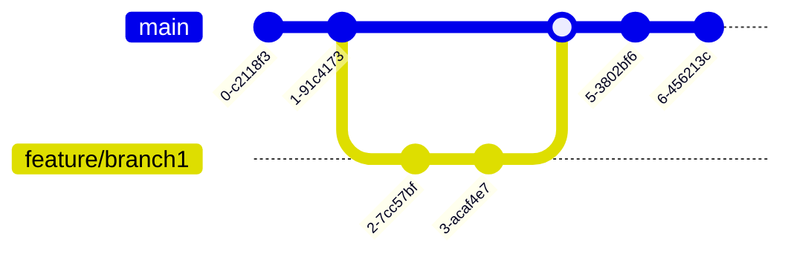

# Contributor's guide

This page contains information about reporting issues, as well as some tips and guidelines useful for open source contributors. Before you start, consider taking a look at the PolyClient's [documentation](https://polyclient.pages.dev/docs); it will provide a good understanding of the project and can help you understand the context of your contributions.

## License

By contributing to this project, you agree to license your contributions under the project's applicable licenses. For more details, see the [License section](README.md#license) in the README.

## How to contribute

This project encourages contributions from the community. You can contribute in the following areas:

- **Feature requests**: Help make the project better by sharing your ideas. Start a conversation by opening a [feedback discussion](https://github.com/polyclient/polyclient/discussions). Once discussed and accepted, an issue will be created, allowing you to work on it or leaving it for others to work on.
- **Documentation**: Help improve the project’s documentation. Small changes like fixing typos or broken links can be submitted directly as a PR. For bigger changes, start a conversation by opening a [feedback discussion](https://github.com/polyclient/polyclient/discussions).
- **Bug discovery**: Help improve the project’s stability by identifying and reporting bugs. Before flagging an issue, [ensure it hasn't been addressed already](https://github.com/polyclient/polyclient/issues). If no one else has reported it, you can either fix it yourself or leave it for others to fix.

## Contribution workflow

1. **Open an issue**: Users start new issues for various reasons such as reporting bugs or proposing changes.
2. **Review and labeling**: The maintainers review the new issues and label them as follows:
   - `duplicate`: Issues that duplicate another and require consolidation.
   - `blocked`: Issues impeded by dependencies or external factors.
   - `needs owner`: Issues ready for work, awaiting volunteer contribution.
   - `needs info`: Issues lacking necessary information or clarity.
   - `wontfix`: Issues falling outside the project's scope and not planned for resolution.
   - `BREAKING`: Issues that introduce significant alterations to the project's codebase or functionality, potentially breaking backward compatibility or requiring substantial reworking of existing implementations.
3. **Volunteer**: You or other volunteers can express interest in resolving issues by offering solutions or volunteering for ownership.
4. **Assignment**: The maintainers assign issues to volunteers, making them the issue’s "owner".
5. **Pull request submission**: The issue owner submits a pull request with the proposed changes to resolve the issue.
6. **Review and merge**: The maintainers review the pull request, provide feedback if necessary, and merge it into the main repository upon approval.

## Good first issues

If you’re new to the codebase, consider starting with issues labeled as [good first issue](https://github.com/polyclient/polyclient/issues?q=is%3Aissue+is%3Aopen+label%3A%22good+first+issue%22+-label%3A%22blocked+by+upstream%22). These issues are relatively straightforward to work on. Before you start, make sure there’s no existing PR for the issue and that it hasn’t been assigned to anyone yet. Once you’ve found an issue you’d like to work on, notify the maintainers by commenting on the issue to ensure proper coordination and prevent overlapping.

## Coding style

This project follows the [Effective Go](https://go.dev/doc/effective_go) guidelines and enforces consistent coding style using the following tools:

- [golangci-lint](https://github.com/golangci/golangci-lint) ([config](.golangci.toml)) for linting and [gofmt](https://pkg.go.dev/cmd/gofmt) for formatting Go code.
- [Biome](https://biomejs.dev/) ([config](gui/biome.json)) for linting and formatting JavaScript code.
- [EditorConfig](https://editorconfig.org/) ([config](.editorconfig)) to maintain consistent coding styles across editors and IDEs.

### Project structure

```sh
polyclient/
├── .github/                            # CI/CD workflows, issue templates, and GitHub configuration
│   └── workflows/
├── build/                              # Wails build configuration
├── cmd/                                # Application entry points
│   ├── client/                         # Wails-based desktop client entry point
│   │   └── main.go
│   └── server/                         # Standalone API server entry point
│       └── main.go
├── docs/                               # Documentation: architecture decisions, API specs, user guides
├── internal/                           # GPL-licensed core functionality
│   ├── core/                           # Core PolyClient functionality
│   │   ├── connection/                 # Connection pooling, protocol management
│   │   ├── session/                    # User session management
│   │   ├── security/                   # Encryption, authentication
│   │   └── orchestration/              # Use case orchestration
│   ├── engine/
│   │   ├── parser/                     # Query parsing and validation
│   │   ├── planner/                    # Query execution planning
│   │   ├── executor/                   # Query execution and result streaming
│   │   ├── pipeline/                   # Data transformation pipelines
│   │   ├── cache/                      # Query and result caching
│   │   ├── monitor/                    # Performance monitoring and metrics
│   │   └── types/                      # Engine-specific data types
│   │   └── errors/                     # Engine-specific error handling
│   ├── api/
│   │   ├── rest/                       # REST API handlers
│   │   └── websocket/                  # Real-time communication
│   └── storage/
│   │   ├── cache/                      # Query caching
│   │   └── settings/                   # User preferences storage
├── pkg/                                # MIT-licensed reusable libraries
│   ├── plugins/                        # Plugin API interfaces
│   ├── ai/                             # AI provider interfaces
│   ├── app/                            # Wails integration layer
│   ├── db/                             # DB adapter interfaces
│   ├── config/                         # Plugin-friendly config structures
│   ├── utils/                          # Generic utilities
│   ├── devtools/                       # Development helpers, mocks, and testing stubs
├── plugins/                            # MIT-licensed built-in plugins
│   ├── db_sqlite/                      # SQLite plugin
│   ├── db_postgresql/                  # PostgreSQL plugin
│   ├── db_mysql/                       # MySQL plugin
│   ├── db_mariadb/                     # MariaDB plugin
│   ├── db_mssql/                       # Microsoft SQL Server plugin
│   ├── db_mongodb/                     # MongoDB plugin
│   ├── db_cockroachdb/                 # CockroachDB plugin
│   ├── db_redis/                       # Redis plugin
│   ├── ai_openai/                      # OpenAI plugin
│   ├── ai_mistral/                     # Mistral plugin
│   ├── ai_ollama/                      # Ollama plugin
│   ├── ai_deepseek/                    # DeepSeek plugin
│   ├── ai_anthropic/                   # Anthropic plugin
│   ├── ai_lmstudio/                    # LM Studio plugin
│   ├── ai_google/                      # Google AI plugin
├── scripts/                            # Maintenance scripts
├── ui/                                 # Svelte-based UI project
│   ├── public/                         # Static assets: images, fonts, global CSS
│   └── src/
│       ├── app.html
│       ├── lib/                        # Shared UI components and utilities
│       └── routes/                     # Svelte routes (pages)
├── e2e/                                # End-to-end testing
├── go.mod                              # Go module file
├── go.sum                              # Go dependencies checksums
├── Taskfile.yml                        # Task runner configuration file (https://taskfile.dev/)
└── README.md                           # Project overview and setup instructions
```

## Git workflow

The git branching model used in this project aligns with [trunk-based development](https://trunkbaseddevelopment.com/).

1. **Development**: Developers work on temporary branches to add new features or fix errors. Changes should be frequently integrated with the main branch (`master`) to minimize merge conflicts.
2. **Code review**: Once changes are complete, a pull request should be created to merge the temporary branch with `master`. The PR should be reviewed and approved by at least one maintainer before merging.
3. **Merge and release**: The pull request is merged into `master`, triggering relevant workflows.


